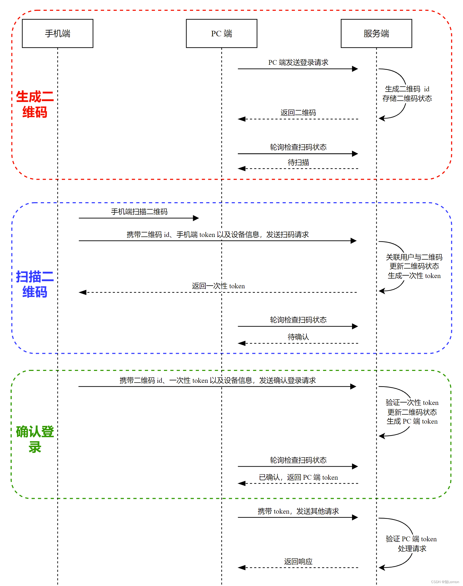

### 二维码的原理是什么？有哪些使用场景

二维码（QR码）是一种二维码码制，它可以储存比传统一维码更多的信息，同时由于其编码方式特殊，使得二维码具有更高的容错率。

二维码的原理是利用黑白像素的组合来表示信息。在二维码中，数据是通过一系列黑白相间的方格（也称为模块）来编码的。在编码过程中，二维码生成器会将输入的数据（如文本、网址等）转换成一串二进制数，然后通过特定的算法将这些二进制数映射成一组黑白相间的模块，最后生成二维码图像。

二维码的使用场景非常广泛，包括但不限于以下几个方面：

1. 商品条码替代：二维码可以存储更多的信息，可以作为商品的唯一标识，实现自动化的库存管理、物流跟踪等功能。
2. 支付扫码：二维码支付已成为移动支付的主要形式之一，用户可以使用手机扫描二维码进行支付。
3. 身份识别：二维码可以储存个人信息，如身份证号码、手机号码等，通过扫描二维码可以快速识别个人身份。
4. 门票验证：二维码可以作为门票的电子验证方式，扫码验证门票，可以有效减少假冒门票的情况。
5. 网址链接：二维码可以直接储存网址信息，用户扫码可以直接访问对应的网站。
6. 营销推广：二维码可以作为营销推广的一种手段，将二维码放在广告、海报等宣传材料上，用户扫码可以获取优惠信息、参与活动等。

总的来说，二维码在现代社会中有着非常广泛的应用，它方便快捷，具有高效、精准、低成本等优点。

### 扫码登录方案

- PC 端发送 “扫码登录” 请求，服务端生成二维码 id，并存储二维码的过期时间、状态等信息
- PC 端获取二维码并显示
- PC 端开始轮询检查二维码的状态，二维码最初为 "待扫描"状态
- 手机端扫描二维码，获取二维码 id
- 手机端向服务端发送 “扫码” 请求，请求中携带二维码 id、手机端 token 以及设备信息
- 服务端验证手机端用户的合法性，验证通过后将二维码状态置为 “待确认”，并将用户信息与二维码关联在一起，之后为手机端生成一个一次性 token，该 token 用作确认登录的凭证
- PC 端轮询时检测到二维码状态为 “待确认”
- 手机端向服务端发送 “确认登录” 请求，请求中携带着二维码 id、一次性 token 以及设备信息
- 服务端验证一次性 token，验证通过后将二维码状态置为 “已确认”，并为 PC 端生成 PC 端 token
- PC 端轮询时检测到二维码状态为 “已确认”，并获取到了 PC 端 token，之后 PC 端不再轮询
- PC 端通过 PC 端 token 访问服务端




### SpringBoot 二维码及条形码简单使用

在Spring Boot中，你可以使用ZXing库轻松生成条形码。首先，确保你的`pom.xml`文件中包含了ZXing库的依赖：

```xml
<!-- 二维码生成 -->
    <dependency>
        <groupId>com.google.zxing</groupId>
        <artifactId>core</artifactId>
        <version>3.3.3</version>
    </dependency>
    <dependency>
        <groupId>com.google.zxing</groupId>
        <artifactId>javase</artifactId>
        <version>3.3.3</version>
    </dependency>
```

然后，你可以创建一个Spring Boot控制器，用于处理生成条形码的请求。以下是一个简单的示例：

```java
import org.springframework.http.MediaType;
import org.springframework.web.bind.annotation.GetMapping;
import org.springframework.web.bind.annotation.PathVariable;
import org.springframework.web.bind.annotation.RequestMapping;
import org.springframework.web.bind.annotation.RestController;
import com.google.zxing.BarcodeFormat;
import com.google.zxing.WriterException;
import com.google.zxing.common.BitMatrix;
import com.google.zxing.oned.Code128Writer;
import com.google.zxing.qrcode.QRCodeWriter;

import javax.imageio.ImageIO;
import javax.servlet.http.HttpServletResponse;
import java.awt.*;
import java.awt.image.BufferedImage;
import java.io.IOException;
import java.io.OutputStream;

@RestController
@RequestMapping("/barcode")
public class BarcodeController {

    @GetMapping(value = "/generateQRCode/{content}", produces = MediaType.IMAGE_PNG_VALUE)
    public void generateQRCode(@PathVariable String content, HttpServletResponse response) throws IOException, WriterException {
        QRCodeWriter qrCodeWriter = new QRCodeWriter();
        BitMatrix bitMatrix = qrCodeWriter.encode(content, BarcodeFormat.QR_CODE, 200, 200);

        BufferedImage bufferedImage = new BufferedImage(200, 200, BufferedImage.TYPE_INT_RGB);
        for (int x = 0; x < 200; x++) {
            for (int y = 0; y < 200; y++) {
                bufferedImage.setRGB(x, y, bitMatrix.get(x, y) ? Color.BLACK.getRGB() : Color.WHITE.getRGB());
            }
        }

        OutputStream outputStream = response.getOutputStream();
        ImageIO.write(bufferedImage, "png", outputStream);
        outputStream.close();
    }

    @GetMapping(value = "/generateBarcode/{content}", produces = MediaType.IMAGE_PNG_VALUE)
    public void generateBarcode(@PathVariable String content, HttpServletResponse response) throws IOException, WriterException {
        Code128Writer code128Writer = new Code128Writer();
        BitMatrix bitMatrix = code128Writer.encode(content, BarcodeFormat.CODE_128, 300, 100);

        BufferedImage bufferedImage = new BufferedImage(300, 100, BufferedImage.TYPE_INT_RGB);
        for (int x = 0; x < 300; x++) {
            for (int y = 0; y < 100; y++) {
                bufferedImage.setRGB(x, y, bitMatrix.get(x, y) ? Color.BLACK.getRGB() : Color.WHITE.getRGB());
            }
        }

        OutputStream outputStream = response.getOutputStream();
        ImageIO.write(bufferedImage, "png", outputStream);
        outputStream.close();
    }
}
```

在这个例子中，`generateQRCode`方法和`generateBarcode`方法分别用于生成QR码和Code128条形码。这两个方法使用了ZXing库创建图像，并通过`HttpServletResponse`返回给客户端。

请注意，`produces = MediaType.IMAGE_PNG_VALUE`注解告诉Spring Boot该端点产生的是图像数据，这样浏览器就能正确处理响应。

你可以通过访问以下URL来测试生成的二维码和条形码：

- 生成QR码：`http://localhost:8080/barcode/generateQRCode/your_content`
- 生成Code128条形码：`http://localhost:8080/barcode/generateBarcode/your_content`

确保将 `your_content` 替换为实际的内容。

### 二维码工具类QRCodeUtil 

maven依赖：

```xml
<!-- 二维码生成 -->
        <dependency>
            <groupId>com.google.zxing</groupId>
            <artifactId>core</artifactId>
            <version>3.3.3</version>
        </dependency>
        <dependency>
            <groupId>com.google.zxing</groupId>
            <artifactId>javase</artifactId>
            <version>3.3.3</version>
        </dependency>
        
        <dependency>
            <groupId>org.projectlombok</groupId>
            <artifactId>lombok</artifactId>
            <version>1.18.0</version>
        </dependency>
        
        <!-- https://mvnrepository.com/artifact/org.apache.commons/commons-lang3 -->
        <dependency>
            <groupId>org.apache.commons</groupId>
            <artifactId>commons-lang3</artifactId>
            <version>3.12.0</version>
        </dependency>
```

QRCodeUtil 类：

```java
import com.google.zxing.BarcodeFormat;
import com.google.zxing.EncodeHintType;
import com.google.zxing.WriterException;
import com.google.zxing.common.BitMatrix;
import com.google.zxing.oned.Code128Writer;
import com.google.zxing.qrcode.QRCodeWriter;
import com.google.zxing.qrcode.decoder.ErrorCorrectionLevel;
import lombok.experimental.UtilityClass;
import lombok.extern.slf4j.Slf4j;
import org.apache.commons.codec.binary.Base64;
import org.apache.commons.lang3.StringUtils;
import org.springframework.web.bind.annotation.RequestParam;

import javax.imageio.ImageIO;
import javax.servlet.ServletOutputStream;
import javax.servlet.http.HttpServletResponse;
import java.awt.*;
import java.awt.geom.RoundRectangle2D;
import java.awt.image.BufferedImage;
import java.io.ByteArrayOutputStream;
import java.io.IOException;
import java.io.OutputStream;
import java.net.URL;
import java.util.HashMap;
import java.util.UUID;

/**
 * 二维码及条形码工具类
 */
@Slf4j
@UtilityClass
public class QRCodeUtil {

    /**
     * 默认宽度
     */
    private static final Integer WIDTH = 140;
    /**
     * 默认高度
     */
    private static final Integer HEIGHT = 140;

    /**
     * LOGO 默认宽度
     */
    private static final Integer LOGO_WIDTH = 22;
    /**
     * LOGO 默认高度
     */
    private static final Integer LOGO_HEIGHT = 22;

    /**
     * 图片格式
     */
    private static final String IMAGE_FORMAT = "png";

    private static final String CHARSET = "utf-8";
    /**
     * 原生转码前面没有 data:image/png;base64 这些字段，返回给前端是无法被解析
     */
    public static final String BASE64_IMAGE_FORMAT = "data:image/png;base64,%s";

    /**
     * 生成二维码，使用默认尺寸
     *
     * @param content 内容
     * @return
     */
    public String getBase64QRCode(String content) {
        return getBase64Image(content, WIDTH, HEIGHT, null, null, null);
    }

    /**
     * 生成二维码，使用默认尺寸二维码，插入默认尺寸logo
     *
     * @param content 内容
     * @param logoUrl logo地址
     * @return
     */
    public String getBase64QRCode(String content, String logoUrl) {
        return getBase64Image(content, WIDTH, HEIGHT, logoUrl, LOGO_WIDTH, LOGO_HEIGHT);
    }

    /**
     * 生成二维码
     *
     * @param content    内容
     * @param width      二维码宽度
     * @param height     二维码高度
     * @param logoUrl    logo 在线地址
     * @param logoWidth  logo 宽度
     * @param logoHeight logo 高度
     * @return
     */
    public String getBase64QRCode(String content, Integer width, Integer height, String logoUrl, Integer logoWidth, Integer logoHeight) {
        return getBase64Image(content, width, height, logoUrl, logoWidth, logoHeight);
    }

    private String getBase64Image(String content, Integer width, Integer height, String logoUrl, Integer logoWidth, Integer logoHeight) {
        ByteArrayOutputStream os = new ByteArrayOutputStream();
        BufferedImage bufferedImage = crateQRCode(content, width, height, logoUrl, logoWidth, logoHeight);
        try {
            ImageIO.write(bufferedImage, IMAGE_FORMAT, os);
        } catch (IOException e) {
            log.error("[生成二维码，错误{}]", e);
        }
        // 转出即可直接使用
//        return String.format(BASE64_IMAGE, Base64.encode(os.toByteArray()));
        return String.format(BASE64_IMAGE_FORMAT, Base64.encodeBase64String(os.toByteArray()));
    }


    /**
     * 生成二维码
     *
     * @param content    内容
     * @param width      二维码宽度
     * @param height     二维码高度
     * @param logoUrl    logo 在线地址
     * @param logoWidth  logo 宽度
     * @param logoHeight logo 高度
     * @return
     */
    private BufferedImage crateQRCode(String content, Integer width, Integer height, String logoUrl, Integer logoWidth, Integer logoHeight) {
        if (StringUtils.isNotBlank(content)) {
            ServletOutputStream stream = null;
            HashMap<EncodeHintType, Comparable> hints = new HashMap<>(4);
            // 指定字符编码为utf-8
            hints.put(EncodeHintType.CHARACTER_SET, CHARSET);
            // 指定二维码的纠错等级为中级
            hints.put(EncodeHintType.ERROR_CORRECTION, ErrorCorrectionLevel.M);
            // 设置图片的边距
            hints.put(EncodeHintType.MARGIN, 2);
            try {
                QRCodeWriter writer = new QRCodeWriter();
                BitMatrix bitMatrix = writer.encode(content, BarcodeFormat.QR_CODE, width, height, hints);
                BufferedImage bufferedImage = new BufferedImage(width, height, BufferedImage.TYPE_INT_RGB);
                for (int x = 0; x < width; x++) {
                    for (int y = 0; y < height; y++) {
                        bufferedImage.setRGB(x, y, bitMatrix.get(x, y) ? 0xFF000000 : 0xFFFFFFFF);
                    }
                }
                if (StringUtils.isNotBlank(logoUrl)) {
                    insertLogo(bufferedImage, width, height, logoUrl, logoWidth, logoHeight);
                }
                return bufferedImage;
            } catch (Exception e) {
                e.printStackTrace();
            } finally {
                if (stream != null) {
                    try {
                        stream.flush();
                        stream.close();
                    } catch (IOException e) {
                        e.printStackTrace();
                    }
                }
            }
        }
        return null;
    }

    /**
     * 二维码插入logo
     *
     * @param source     二维码
     * @param width      二维码宽度
     * @param height     二维码高度
     * @param logoUrl    logo 在线地址
     * @param logoWidth  logo 宽度
     * @param logoHeight logo 高度
     * @throws Exception
     */
    private void insertLogo(BufferedImage source, Integer width, Integer height, String logoUrl, Integer logoWidth, Integer logoHeight) throws Exception {
        // logo 源可为 File/InputStream/URL
        Image src = ImageIO.read(new URL(logoUrl));
        // 插入LOGO
        Graphics2D graph = source.createGraphics();
        int x = (width - logoWidth) / 2;
        int y = (height - logoHeight) / 2;
        graph.drawImage(src, x, y, logoWidth, logoHeight, null);
        Shape shape = new RoundRectangle2D.Float(x, y, logoWidth, logoHeight, 6, 6);
        graph.setStroke(new BasicStroke(3f));
        graph.draw(shape);
        graph.dispose();
    }


    /**
     * 获取二维码（包含内容）
     *
     * @param content 内容
     * @param output  输出流
     * @throws IOException
     */
    public void getQRCode(String content, OutputStream output) throws IOException {
        BufferedImage image = crateQRCode(content, WIDTH, HEIGHT, null, null, null);
        ImageIO.write(image, IMAGE_FORMAT, output);
    }

    /**
     * 获取二维码（包含内容和logo）
     *
     * @param content 内容
     * @param logoUrl logo资源
     * @param output  输出流
     * @throws Exception
     */
    public void getQRCode(String content, String logoUrl, OutputStream output) throws Exception {
        BufferedImage image = crateQRCode(content, WIDTH, HEIGHT, logoUrl, LOGO_WIDTH, LOGO_HEIGHT);
        ImageIO.write(image, IMAGE_FORMAT, output);
    }

    /**
     * 获取条形码
     * @param content 内容
     * @param outputStream 输出流，比如HttpServletResponse::OutputStream
     * @throws IOException
     * @throws WriterException
     */
    public void generateBarcode(String content, OutputStream outputStream) throws IOException, WriterException {
        Code128Writer code128Writer = new Code128Writer();
        BitMatrix bitMatrix = code128Writer.encode(content, BarcodeFormat.CODE_128, 300, 100);

        BufferedImage bufferedImage = new BufferedImage(300, 100, BufferedImage.TYPE_INT_RGB);
        for (int x = 0; x < 300; x++) {
            for (int y = 0; y < 100; y++) {
                bufferedImage.setRGB(x, y, bitMatrix.get(x, y) ? Color.BLACK.getRGB() : Color.WHITE.getRGB());
            }
        }

        ImageIO.write(bufferedImage, "png", outputStream);
        outputStream.close();
    }

    public static void main(String[] args) {
        UUID uuid = UUID.randomUUID();
        System.out.println(uuid.toString().replace("-", ""));
    }

}

```

### 如何设计高性能的二维码生成和扫码接口，支持高并发访问、高可用、低延时

要设计高性能的二维码生成和扫码接口，需要考虑以下几个方面：

1. 使用高性能的二维码生成库和扫码库：选择性能高的二维码生成和扫码库可以大幅提升接口的响应速度和并发能力。
2. 建议使用分布式部署：通过将二维码生成和扫码接口分别部署在不同的服务器上，可以大幅提高并发能力和可用性。使用负载均衡器可以平衡流量，确保每台服务器的负载均衡。
3. 采用缓存机制：通过将二维码图片和扫描结果缓存到内存或者分布式缓存中，可以大幅提升接口的响应速度和并发能力。推荐使用高性能的缓存组件，如Redis、Memcached等。
4. 采用异步处理机制：将二维码生成和扫码接口设计成异步处理模式，可以大幅提高接口的并发能力。可以使用消息队列、线程池等机制实现异步处理。
5. 设计API接口合理：设计合理的API接口可以提高接口的可用性和易用性。比如可以设计RESTful API接口，让接口具有更好的可读性、可维护性和易用性。
6. 采用HTTPS协议：采用HTTPS协议可以保障数据传输的安全性和完整性，提升接口的可用性和可靠性。
7. 设计合理的容错机制：对于网络中断、服务器异常等错误情况，需要设计合理的容错机制，以保障接口的可用性和稳定性。
8. 采用压力测试：对接口进行压力测试可以发现并发性能瓶颈和性能问题，通过针对性的优化可以大幅提升接口的性能和可用性。
9. 使用CDN加速和DNS负载均衡：为了降低延时，可以使用CDN加速和DNS负载均衡技术。CDN加速可以将静态资源缓存在离用户较近的CDN节点上，提高访问速度。DNS负载均衡可以根据用户的地理位置、网络状况等因素，将请求分配到最优的服务器上，减少延时。

综上所述，设计高性能的二维码生成和扫码接口需要综合考虑多个方面，包括选择高性能的库、分布式部署、缓存机制、异步处理、API设计、HTTPS协议、容错机制以及压力测试等。


参考：

1. https://blog.csdn.net/lemon_TT/article/details/124973714
2. https://juejin.cn/post/6844904111398191117?utm_source=gold_browser_extension